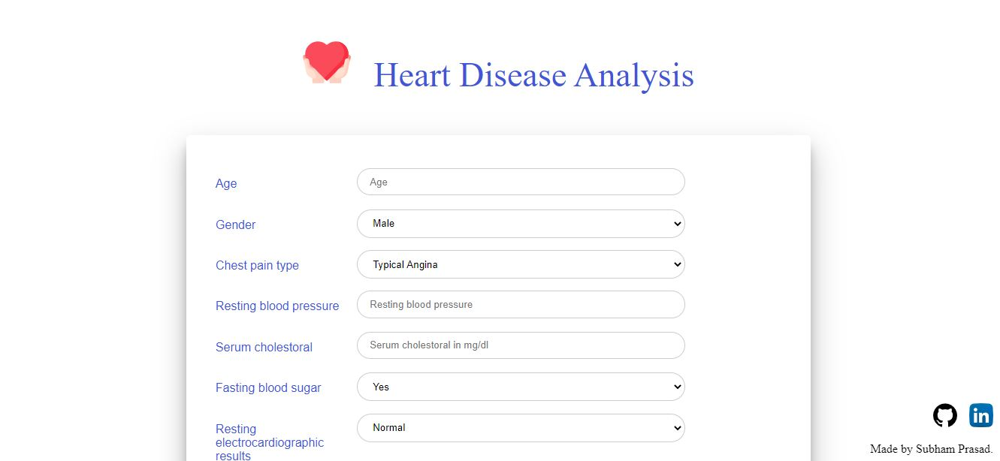

# Heart_Disease_Analysis
Heart disease analysis using ML model (Model will be deployed in Heroku using Flask)

 
 

• Please do check the web app : 
Deployed at: _https://heart-analysis.herokuapp.com/_

• The home page of the web app:

 
